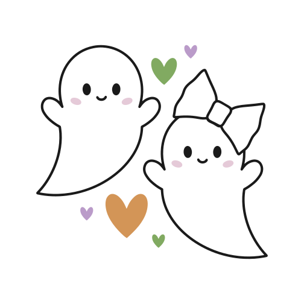
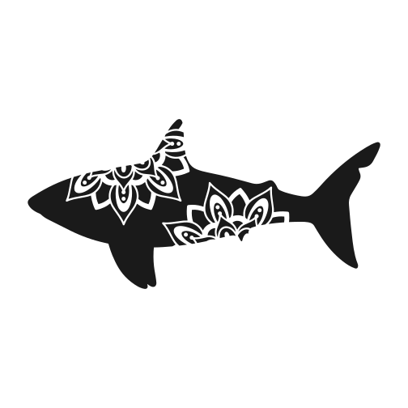
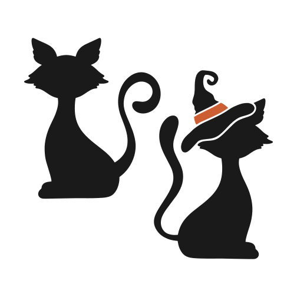

<p align="center">
  
</p>

<h1 align="center">MemGame</h1>

<p align="center">
  <strong>Мобильная игра «Память» в тематике Trick or Treat</strong><br />
  Найди все пары карточек с животными — быстрее и с меньшим числом ошибок!
</p>

<p align="center">
  
</p>

<p align="center">
  
  
  
  
</p>

---

## О игре

**MemGame** — классическая игра на память для iOS и Android. На поле 36 карточек (18 пар) с забавными иконками животных и Halloween-элементами. Переворачивай карты, запоминай расположение и собирай пары.

| | |
|---|---|
| **Поле** | 6 × 6 карточек |
| **Пары** | 18 уникальных изображений |
| **Старт** | Нажми любую карту |
| **Таймер** | Отсчёт времени с первого хода |
| **Перезапуск** | Кнопка **NEW GAME** |

### Как играть

1. Нажми любую карту — игра начнётся, запустится таймер.
2. Первая открытая карта остаётся видимой **5 секунд**, затем переворачивается обратно.
3. Открой вторую карту — если пара совпала, карты остаются открытыми.
4. Если не совпала — через **1 секунду** обе карты закроются.
5. Собери все 18 пар — на экране появится итоговое время.

---

## Превью

> В репозитории нет скриншотов симулятора, поэтому ниже — визуальные материалы из самого приложения: иконка, заставка и карточки.

<p align="center">
  
  &nbsp;&nbsp;&nbsp;
  
</p>

<p align="center">
  <em>Слева — иконка приложения · Справа — рубашка карты (Treat)</em>
</p>

### Карточки в игре

<table align="center">
  <tr>
    <td align="center"><br /><sub>Bunny</sub></td>
    <td align="center"><br /><sub>Cow</sub></td>
    <td align="center"><br /><sub>Tiger</sub></td>
    <td align="center"><br /><sub>Unicorn</sub></td>
    <td align="center"><br /><sub>Ghosts</sub></td>
    <td align="center"><br /><sub>Skull</sub></td>
  </tr>
  <tr>
    <td align="center"><br /><sub>Dolphin</sub></td>
    <td align="center"><br /><sub>Elephant</sub></td>
    <td align="center"><br /><sub>Bear</sub></td>
    <td align="center"><br /><sub>Shark</sub></td>
    <td align="center"><br /><sub>Owls</sub></td>
    <td align="center"><br /><sub>Cats</sub></td>
  </tr>
</table>

<p align="center">
  <em>И ещё 6 пар: rabbit, bull, wolf, moose, pig, birds</em>
</p>

---

## Стек технологий

| Категория | Библиотеки |
|-----------|------------|
| UI | React Native, styled-components |
| Анимации | react-native-flip-card |
| Графика | react-native-svg |
| Запуск | react-native-bootsplash |
| Язык | TypeScript |

---

## Быстрый старт

### Требования

- Node.js ≥ 18
- [Настроенное окружение React Native](https://reactnative.dev/docs/set-up-your-environment)
- Xcode (iOS) / Android Studio (Android)

### Установка

```sh
npm install
```

### iOS — CocoaPods (первый запуск)

```sh
bundle install
bundle exec pod install --project-directory=ios
```

### Запуск

```sh
# Metro
npm start

# Android
npm run android

# iOS
npm run ios
```

### Сборка релиза (Android)

```sh
npm run android:apk   # APK
npm run android:aab   # AAB для Google Play
```

---

## Структура проекта

```
memorygame/
├── App.tsx                 # Точка входа
├── src/
│   ├── components/         # Card, Timer, Button, Icon…
│   ├── containers/         # Game, Board
│   ├── consts/             # Константы игры
│   ├── functs/             # Логика доски и перемешивания
│   ├── hooks/              # Таймер
│   ├── img/                # SVG-иконки карточек
│   └── styles/             # styled-components
├── android/
├── ios/
└── assets/                 # Boot splash, иконки
```

---


